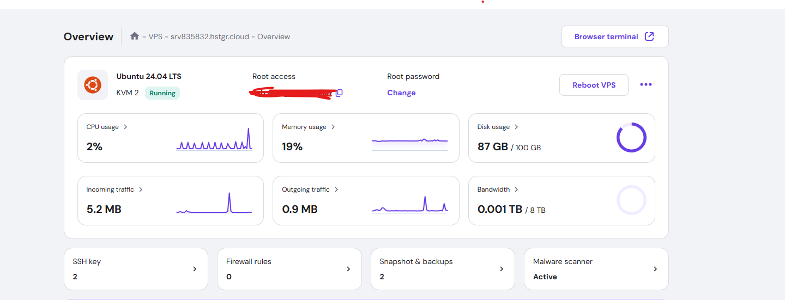
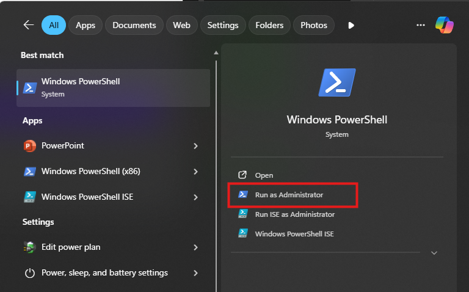
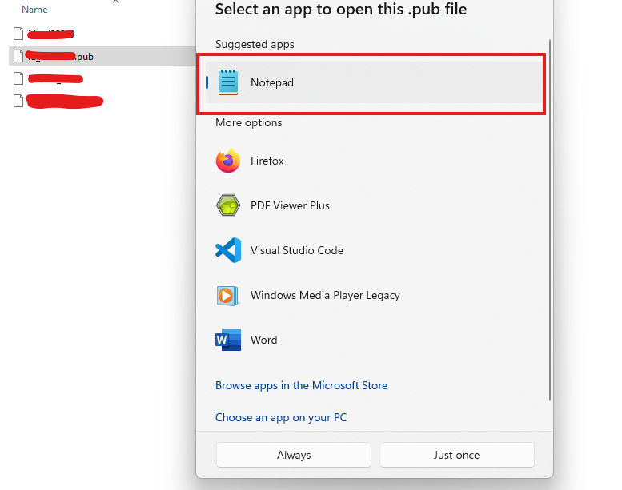
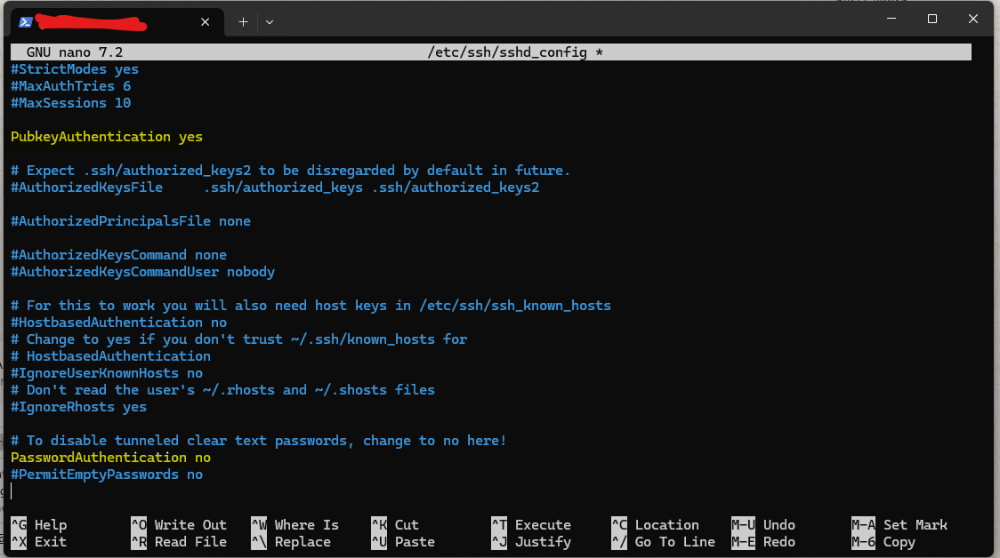
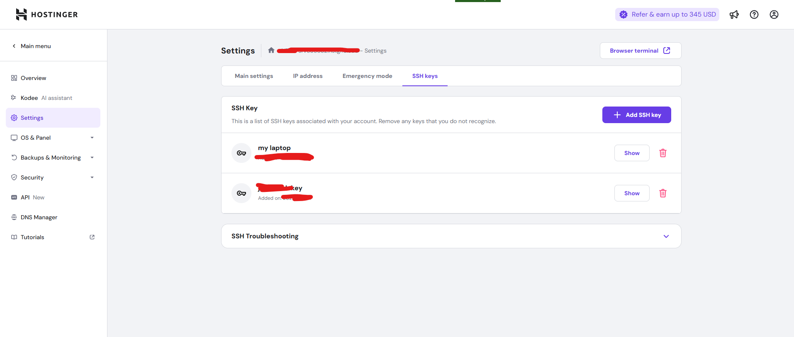
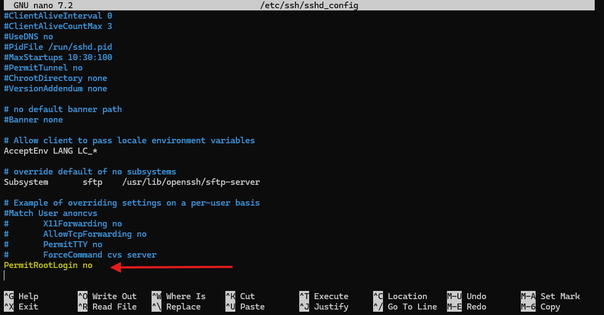
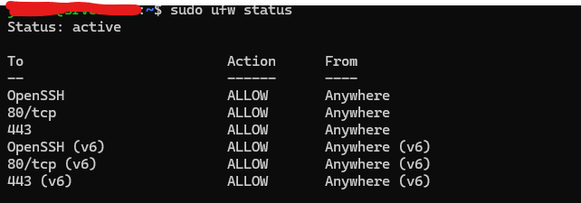

# **VPS Security Setup Guide**

### 🔐 SSH: A Secure Way to Connect Remotely

SSH (Secure Shell) হলো একটি নিরাপদ পদ্ধতি যার মাধ্যমে আপনি দূরবর্তী কোনো সার্ভার বা কম্পিউটারে সংযুক্ত হতে পারেন ইন্টারনেট বা নেটওয়ার্কের মাধ্যমে।
Linux ও macOS-এ এটি ডিফল্টভাবে ইনস্টল থাকে, আর Windows-এ আপনি PowerShell অথবা অন্যান্য SSH ক্লায়েন্ট দিয়ে ব্যবহার করতে পারেন।

### ✅ VPS-এ SSH দিয়ে সংযুক্ত হওয়া

```bash
ssh root@58.10.98.245
```


প্রথমবার সংযুক্ত হওয়ার সময় একটি বার্তা আসবে যেখানে জিজ্ঞেস করবে আপনি সার্ভারটিতে সংযুক্ত হতে চান কি না। **"yes"** টাইপ করলে আপনার কম্পিউটার সার্ভারের "fingerprint" মনে রাখবে।

পরবর্তীতে যখন আপনি আবার সংযুক্ত হবেন, তখন এটি আগের fingerprint মিলিয়ে দেখবে। যদি না মিলে, তাহলে এটি আপনাকে সংযুক্ত হতে দেবে না—এবং সেটি একটি সম্ভাব্য নিরাপত্তা হুমকি হতে পারে।
<span style="color:red">**তাই সতর্ক থাকুন! যদি হঠাৎ করে fingerprint পরিবর্তিত দেখায় এবং আপনি জানেন না কেন—তাহলে সার্ভার কমপ্রোমাইজড হতে পারে।**</span>

এরপর এটি আপনার পাসওয়ার্ড চাইবে—আপনার VPS প্রদানকারীর কাছ থেকে পাওয়া root পাসওয়ার্ডটি এখানে দিন।

---

### 🔄 সিস্টেম আপডেট ও প্যাকেজ আপগ্রেড

VPS কেনার পর প্রথম কাজগুলোর মধ্যে একটি হওয়া উচিত আপনার সিস্টেমের প্যাকেজ লিস্ট আপডেট এবং সফটওয়্যার প্যাকেজগুলো আপগ্রেড করা।

```bash
apt update
```

আমার সার্ভারটি Ubuntu(24) চালিত, যা Debian ভিত্তিক একটি ডিস্ট্রিবিউশন। এ ধরণের সিস্টেমে <span style="background-color: yellow; color: black;"> **APT (Advanced Package Tool)**</span>
ব্যবহার করা হয় সফটওয়্যার ম্যানেজমেন্টের জন্য।

🔍 `apt update` মূলত নতুন প্যাকেজের তথ্য সংগ্রহ করে—মানে, এটি আপনার সিস্টেমকে জানায় কী কী নতুন সফটওয়্যার বা আপডেট পাওয়া যাচ্ছে।

💡 যদি আপনার সার্ভারটি Red Hat ভিত্তিক হয়ে থাকে <span style="color:red">(যেমন: CentOS, Fedora),</span>
তাহলে `apt` এর পরিবর্তে `dnf` বা `yum` কমান্ড ব্যবহার করতে হবে। উদাহরণ:

```bash
dnf update
```

---

### 🚀 সিস্টেম আপগ্রেড ও রিবুট প্রসেস

<span style=" color: green;">📌 মনে রাখবেন:</span>

`apt update` কেবলমাত্র প্যাকেজ লিস্ট আপডেট করে, কিন্তু প্যাকেজ আপগ্রেড করে না। এজন্য আপনাকে নিচের কমান্ডটি ব্যবহার করতে হবে:

```bash
apt upgrade
```

এই কমান্ডটি সব আপগ্রেডযোগ্য সফটওয়্যার প্যাকেজগুলো আপগ্রেড করে দেবে।

---

### 🔁 রিবুট লাগবে কিনা চেক করা

কিছু কিছু আপডেট এমন হয় যার জন্য পুরো সার্ভার রিবুট দরকার হয়। আপনি নিচের কমান্ড দিয়ে যাচাই করতে পারেন:

```bash
cat /var/run/reboot-required
```


📄 যদি `reboot-required` নামের এই ফাইলটি থাকে, তাহলে বুঝতে হবে সার্ভার রিবুট দেওয়া প্রয়োজন।

---

### 🔄 VPS রিবুট করার উপায়

🔸 আপনি চাইলে আপনার VPS প্রোভাইডারের ড্যাশবোর্ড (যেমন: Hostinger, DigitalOcean, Vultr ইত্যাদি) থেকে সরাসরি সার্ভার রিবুট দিতে পারেন।


🔸আমি Hostinger ব্যবহার করেছি, তাই আমি Hostinger এর ছবি দিলাম,  যদি আপনি Hostinger ব্যবহার না করেন, তাহলে আপনার প্রোভাইডারের ড্যাশবোর্ডে কোথায় রিবুট অপশন আছে সেটা খুঁজে নিন।
🔍 না পেলে চিন্তা নেই—SSH দিয়েই আপনি সহজে রিবুট করতে পারেন এই কমান্ড দিয়ে:

```bash
reboot
```

👉 একবার রিবুট হলে আপনার সার্ভার পুনরায় চালু হয়ে যাবে। এতে অল্প সময় লাগতে পারে,  এরপর SSH দিয়ে আবার সংযুক্ত হতে পারবেন।

## 👤 **নন-রুট (Non-Root) ইউজার তৈরি করা**

আমরা এখন পর্যন্ত VPS-এ **root** ইউজার ব্যবহার করে কাজ করেছি। যদিও root ইউজার সবধরনের কাজ করতে পারে, কিন্তু সবসময় root হিসেবে লগইন থাকা নিরাপদ নয়। কারণ root ইউজারের একটিমাত্র ভুল কমান্ড পুরো সার্ভারে ক্ষতি করতে পারে।

তাই চলুন আমরা একটি নতুন **non-root** ইউজার তৈরি করি, যেটি প্রয়োজনে `sudo` ব্যবহার করে administrative কাজ করতে পারবে।

```bash
adduser mahmud
```

এখানে `mahmud` নামের নতুন একটি ইউজার তৈরি হবে।

📌 এটি নতুন পাসওয়ার্ড চাবে—পাসওয়ার্ডটি root ইউজারের থেকে আলাদা রাখবেন  নিরাপত্তার জন্য।

---

### 🔐 ইউজারকে `sudo` গ্রুপে যুক্ত করা

নতুন ইউজার এখনো `sudo` ব্যবহার করে administrative কাজ করতে পারবে না। এজন্য তাকে `sudo` গ্রুপে যুক্ত করতে হবে:

```bash
usermod -aG sudo mahmud
```

চেক করার জন্য:

```bash
groups mahmud
```

এখানে যদি `sudo` দেখায়, তাহলে বুঝবেন ইউজার সফলভাবে sudo group-এ যুক্ত হয়েছে।

---

### 🔁 এখন SSH ত্যাগ করে নতুন ইউজার দিয়ে লগইন করুন

```bash
exit
ssh mahmud@58.10.98.245
```

এখন আপনি যদি `apt update`, `apt upgrade` এর মতো কমান্ড চালাতে চান, তাহলে এগুলোর আগে `sudo` ব্যবহার করতে হবে:

```bash
sudo apt update
```

একবার চেষ্টা করে দেখুন, এটি এখন কাজ করবে।

---

## 🔧 **পরীক্ষার জন্য একটি সফটওয়্যার ইনস্টল করা**

চলুন `neovim` নামের একটি জনপ্রিয় টার্মিনাল টেক্সট এডিটর ইনস্টল করে দেখি:

```bash
sudo apt install neovim
```

---

## 🔑 **SSH কী ব্যবহার করে নিরাপদ লগইন সেটআপ**

আমরা এখন পর্যন্ত পাসওয়ার্ড দিয়ে SSH ব্যবহার করেছি। কিন্তু পাসওয়ার্ড দুর্বল হলে তা brute-force আক্রমণের শিকার হতে পারে। তাই আমরা এখন থেকে **SSH Key-based authentication** ব্যবহার করব।

---

### 🛠️ SSH Key তৈরি করা

আপনার লোকাল মেশিন থেকে SSH কী জেনারেট করতে নিচের কমান্ডটি দিন:

```bash
ssh-keygen -t ed25519 -C "your_email@example.com"
```

👴 পুরোনো সিস্টেমে থাকলে নিচের RSA কমান্ড ব্যবহার করুন:

```bash
ssh-keygen -t rsa -b 4096 -C "your_email@example.com"
```

📂 SSH কী সাধারণত নিচের ডিরেক্টরিতে সংরক্ষিত হয়:

- Windows: `C:\Users\Username\.ssh\`
- Linux/macOS: `~/.ssh/`

---

### 🪪 Windows-এ SSH Agent চালু করা

PowerShell (Run as Administrator) ওপেন করুন এবং নিচের কমান্ড দিন:

```powershell
Get-Service -Name ssh-agent | Set-Service -StartupType Automatic
Start-Service ssh-agent
```


এতে করে Windows রিবুট হলেও ssh-agent চালু থাকবে। বিকল্পভাবে:

- Windows সার্চে গিয়ে “Services” লিখে সার্ভিস খুলুন।
- "OpenSSH Authentication Agent" সার্ভিস খুঁজে বের করুন।
- Right-click → Properties → Startup type: **Automatic** → Start দিন।

---

### ➕ SSH কী Agent-এ যোগ করা

```bash
ssh-add .\\.ssh\\id_ed25519
```

📌 আপনি যদি কী ফাইলের নাম অন্যরকম রাখেন, তাহলে সেই নাম অনুযায়ী দিন। উদাহরণস্বরূপ:

```bash
ssh-add ~/.ssh/my_custom_key
```

এভাবে কী এজেন্টে যুক্ত করলে আপনি ভবিষ্যতে পাসওয়ার্ড না দিয়েই SSH করতে পারবেন।

---

পরবর্তী ধাপে আমরা দেখব কীভাবে এই পাবলিক কী আপনার VPS-এ আপলোড করবেন এবং পাসওয়ার্ড লগইন একদমই বন্ধ করে SSH Key authentication বাধ্যতামূলক করে দেবেন।

## 🔑 **VPS-এ SSH Public Key যুক্ত করা**

### ✅ ধাপ ১: Public Key কপি করা

প্রথমে আপনার SSH কী-এর `.pub` ফাইলের কনটেন্ট কপি করুন। এটি পাবলিক কী যা শেয়ার করা নিরাপদ—**ব্যক্তিগত কী (যার এক্সটেনশন নেই) কখনোই শেয়ার করবেন না।**

```bash
cat ~/.ssh/id_ed25519.pub
```

🔍 আপনি চাইলে `.pub` ফাইলটি Notepad বা Text Editor দিয়ে খুলেও কপি করতে পারেন।

---

### ✅ ধাপ ২: Non-Root ইউজার দিয়ে VPS-এ লগইন করুন

যেহেতু আমরা non-root ইউজারের মাধ্যমে লগইন করতে চাই, তাই Hostinger-এর SSH Key অপশন ব্যবহার না করে, সরাসরি VPS-এ গিয়ে কী সেটআপ করব।

---

### ✅ ধাপ ৩: `.ssh` ফোল্ডার তৈরি করা (যদি না থাকে)

```bash
mkdir ~/.ssh
cd ~/.ssh
```

---

### ✅ ধাপ ৪: `authorized_keys` ফাইলে Public Key পেস্ট করা


```bash
nano authorized_keys
```

🔹 এখানে আপনার `.pub` ফাইলের কনটেন্ট পেস্ট করুন।

📌 **সংরক্ষণ ও বাহির হওয়ার নিয়ম (Nano Editor):**

- `Ctrl + O` → Enter দিয়ে Save
- `Ctrl + X` → Exit

---

### ✅ ধাপ ৫: SSH দিয়ে পুনরায় লগইন পরীক্ষা

এখন VPS থেকে লগআউট করুন এবং নতুনভাবে SSH দিয়ে লগইন করুন:

```bash
ssh mahmud@58.10.98.245
```

🔒 আপনি যদি SSH Key তৈরি করার সময় পাসফ্রেইজ দিয়ে থাকেন, তাহলে সেটি চাইবে। আপনি চাইলে `ssh-add` দিয়ে agent-এ যুক্ত করে তা এড়াতে পারেন।

---

## 🚫 **Password Login বন্ধ করে SSH Key Only Login চালু করা**

---

### ⚠️ **⚠️ গুরুত্বপূর্ণ: এই ধাপটি করার আগে অবশ্যই SSH Key সেটআপ করে নিন!**

<span style="background-color:#b51b44; color: #fff;">
যদি SSH Key সঠিকভাবে সেটআপ না থাকে, তাহলে আপনি VPS-এ আর ঢুকতে পারবেন না।
নতুন কম্পিউটার দিয়ে লগইন করতে চাইলে, সেই কম্পিউটারে SSH Key জেনারেট করে Public Key আবার VPS-এ বসাতে হবে।</span>


---

### ✅ ধাপ ১: SSH সার্ভারের কনফিগারেশন ফাইল এডিট করা


```bash
sudo nano /etc/ssh/sshd_config
```

```diff
# নিচে গিয়ে এই লাইনের মান পরিবর্তন করুন:
PasswordAuthentication no
```

Save করুন `Ctrl + O`, Exit করুন `Ctrl + X`।

---

### ✅ ধাপ ২: অতিরিক্ত cloud-init কনফিগারেশন আপডেট করা (Hostinger VPS-এর জন্য প্রযোজ্য)

Hostinger VPS-এ `PasswordAuthentication yes` সেট করা থাকে `/etc/ssh/sshd_config.d/50-cloud-init.conf` ফাইলে।

```bash
sudo nano /etc/ssh/sshd_config.d/50-cloud-init.conf
```

```diff
PasswordAuthentication no
```

Save করুন এবং Exit করুন।

---

### ✅ ধাপ ৩: SSH সার্ভিস রিস্টার্ট করা

```bash
sudo systemctl restart ssh
```

📌 **CentOS হলে কমান্ডটি হতে পারে:**

```bash
sudo systemctl restart sshd
```

---

### ✅ ধাপ ৪: Root ইউজার দিয়ে লগইন বন্ধ হয়ে গেছে

এখন আপনি যদি root দিয়ে লগইন করার চেষ্টা করেন, তাহলে দেখবেন কাজ করছে না—কারণ root ইউজারের SSH Key সেটআপ করা হয়নি।

📌 চাইলে Hostinger Dashboard থেকে root-এর SSH Key সেট করতে পারেন।


তবে আমরা আরও ভালো পদ্ধতি ব্যবহার করব—**root ইউজারকেই পুরোপুরি নিষ্ক্রিয় করে দেব।**


## 🚫 **Root ইউজার লগইন বন্ধ করা**

আমরা চাই যে কেউ যেন সরাসরি `root` ইউজার দিয়ে সার্ভারে লগইন করতে না পারে—এতে করে সার্ভারের নিরাপত্তা অনেকটাই বাড়বে।

### ✅ ধাপ ১: SSH কনফিগারেশন ফাইল এডিট করুন

```bash
sudo nano /etc/ssh/sshd_config
```

### ✅ ধাপ ২: নিচের লাইনটি খুঁজে বের করুন

```bash
PermitRootLogin yes
```

এখন এটিকে পরিবর্তন করুন:

```bash
PermitRootLogin no
```


📌 বিকল্পভাবে আপনি `PermitRootLogin without-password` সেট করতে পারেন যদি আপনি SSH Key দিয়ে লগইন চালু রাখেন, কিন্তু যেহেতু আমরা আগেই পাসওয়ার্ড লগইন বন্ধ করে দিয়েছি, তাই এটি প্রাসঙ্গিক নয়।

---

## 🔥 **Firewall সেটআপ করা (UFW দিয়ে)**

**Firewall** মূলত একটি নিরাপত্তা দেয়াল, যা আপনার সার্ভারের ইনকামিং এবং আউটগোয়িং ট্রাফিক নিয়ন্ত্রণ করে। এতে আপনি নির্ধারণ করতে পারেন কোন সার্ভিস বা পোর্টগুলো ওপেন থাকবে।

### ✅ UFW (Uncomplicated Firewall) ইনস্টল করা

**Hostinger VPS**-এ এটি সাধারণত ডিফল্টভাবে ইনস্টল থাকে এবং inactive করে রাখে ওরা। না থাকলে:

```bash
sudo apt install ufw
```

---

### ✅ ফায়ারওয়ালের স্ট্যাটাস চেক করুন

```bash
sudo ufw status
```

প্রথমে এটি Inactive দেখাবে।

---

### ✅ সমস্ত ইনকামিং রিকোয়েস্ট ব্লক করা

```bash
sudo ufw default deny incoming
```

### ✅ সমস্ত আউটগোয়িং রিকোয়েস্ট অনুমোদন করা

```bash
sudo ufw default allow outgoing
```

---

### 🛡️ **সবচেয়ে গুরুত্বপূর্ণ: SSH (OpenSSH) সংযোগ চালু রাখা**

যেহেতু SSH দিয়ে আমরা সার্ভারে কাজ করছি, তাই Port 22 (ডিফল্ট SSH Port) অবশ্যই ফায়ারওয়ালে Allow করতে হবে।

```bash
sudo ufw allow OpenSSH
```

📌 যদি আপনি SSH-এর পোর্ট নাম্বার পরিবর্তন করে থাকেন, তাহলে সেটি স্পষ্টভাবে উল্লেখ করতে হবে। যেমন:

```bash
sudo ufw allow 2222/tcp
```

---

### ✅ অ্যাড করা কনফিগারেশন দেখতে

```bash
sudo ufw show added
```

---

### ⚠️ **ফায়ারওয়াল চালু করার আগে SSH Allow দেওয়া নিশ্চিত করুন**

```diff
🚨 SSH সংযোগ ALLOW না করে firewall ENABLE করলে, আপনি VPS-এ আর লগইন করতে পারবেন না!
```

---

### ✅ ফায়ারওয়াল চালু করুন

```bash
sudo ufw enable
```


---

## 🌐 **HTTP ও HTTPS কানেকশন চালু করা**

ভবিষ্যতে আমরা ওয়েবসাইট বা ওয়েব অ্যাপ্লিকেশন হোস্ট করব, তাই HTTP (port 80) এবং HTTPS (port 443) কানেকশন চালু রাখতে হবে।

```bash
sudo ufw allow http
# বিকল্প: sudo ufw allow 80/tcp

sudo ufw allow https
# বিকল্প: sudo ufw allow 443/tcp
```
চাইলে আপনি আবার চেক করে দেখতে পারেন, এই যেমন আমার।
```bash
sudo ufw status
```



---

## 🛡️ **Fail2Ban সেটআপ: VPS-এ অতিরিক্ত নিরাপত্তা যুক্ত করুন**

**Fail2Ban** একটি নিরাপত্তা টুল যা সার্ভারের লগ ফাইল বিশ্লেষণ করে সন্দেহজনক কার্যকলাপ (যেমন: বারবার ভুল পাসওয়ার্ড দিয়ে SSH লগইন করার চেষ্টা) শনাক্ত করে এবং স্বয়ংক্রিয়ভাবে IP address ব্লক করে দেয় নির্দিষ্ট সময়ের জন্য।

---

### ✅ ধাপ ১: Fail2Ban ইনস্টল করা

```bash
sudo apt update
sudo apt install fail2ban -y
```

---

### ✅ ধাপ ২: মূল কনফিগারেশন ফাইল কপি করে `.local` ফাইল তৈরি করা

আমরা `jail.conf` ফাইল সরাসরি পরিবর্তন করব না। পরিবর্তে একটি `.local` ফাইল তৈরি করব, যেটি Safe Practice।

```bash
sudo cp /etc/fail2ban/jail.conf /etc/fail2ban/jail.local
```

---

### ✅ ধাপ ৩: `.local` ফাইল এডিট করে প্রয়োজনীয় সেটিংস পরিবর্তন করা

```bash
sudo nano /etc/fail2ban/jail.local
```

ফাইলে নিচের মত কিছু গুরুত্বপূর্ণ অংশ খুঁজে বের করুন এবং প্রয়োজন অনুযায়ী কনফিগার করুন:

```ini
[DEFAULT]
# কতবার ব্যর্থ প্রচেষ্টা হলে IP ব্যান হবে
maxretry = 5

# কতক্ষণ ব্যান থাকবে (সেকেন্ডে)
bantime = 3600

# লগফাইলে কত সময় আগের ট্রাই গণনা করবে
findtime = 600
```

---

### ✅ ধাপ ৪: SSH-এর জন্য Fail2Ban চালু করা আছে কিনা যাচাই করুন

ফাইলের মধ্যে নিচের অংশটি নিশ্চিত করুন:

```ini
[sshd]
enabled = true
```

যদি `enabled = false` থাকে, সেটিকে `true` করুন।

---

### ✅ ধাপ ৫: Fail2Ban সার্ভিস রিস্টার্ট করুন

```bash
sudo systemctl restart fail2ban
```

এবং Status চেক করুন:

```bash
sudo systemctl status fail2ban
```

---

### ✅ ধাপ ৬: ব্যান হওয়া IP চেক করা (পরবর্তীতে)

```bash
sudo fail2ban-client status sshd
```

এতে আপনি দেখতে পাবেন কতগুলো IP ব্যান হয়েছে এবং বর্তমানে active আছে কিনা।

---

## ⚙️ অতিরিক্ত: নিজের আইপি ব্যান হয়ে গেলে কী করবেন?

1. আপনার প্রোভাইডারের কনসোল (যেমন Hostinger Dashboard) ব্যবহার করে লগইন করুন।
2. `/etc/fail2ban/jail.local` ফাইলে গিয়ে `ignoreip = আপনার_IP` যোগ করুন যেন নিজের IP ব্যান না হয়।

---

এখন আপনার VPS:

- 🔒 Password authentication বন্ধ ✅
- 🔐 SSH Key only login ✅
- 🚫 Root login নিষ্ক্রিয় ✅
- 🔥 Firewall সক্রিয় ✅
- 🛡️ Fail2Ban দ্বারা সুরক্ষিত ✅

---

# 🥶🥶🥶🥶🥶🥶 বোনাস বোনাস বোনাস 🥶🥶🥶🥶🥶

## 🔒 **Custom SSL Certificate কীভাবে তৈরি ও রিনিউ করবেন এবং Cloudflare-এর মাধ্যমে Free SSL ব্যবহার করার সুবিধা ও সেটআপ প্রসেস**


## 🔧 Part 1: **Custom SSL Certificate (Self-signed) তৈরি ও রিনিউ করা**

### 📌 এই ধরণের সার্টিফিকেট সাধারণত internal সার্ভার, testing বা local network environment-এ ব্যবহৃত হয়। Public browser-এ এটি *"Not Secure"* হিসেবে দেখায়।

### ✅ ধাপ ১: OpenSSL দিয়ে সার্টিফিকেট জেনারেট করুন

```bash
sudo openssl req -x509 -nodes -days 365 -newkey rsa:2048 \
-keyout /etc/ssl/private/selfsigned.key \
-out /etc/ssl/certs/selfsigned.crt
```

এই কমান্ডটি দুইটি ফাইল তৈরি করবে:

* `selfsigned.key` → প্রাইভেট কী
* `selfsigned.crt` → সার্টিফিকেট

📋 এটি আপনাকে কিছু তথ্য জিজ্ঞেস করবে (Country, Organization, CN)। CN (Common Name) হিসেবে আপনার সার্ভারের ডোমেইন দিন, যেমন `yourdomain.com`।

---

### ✅ ধাপ ২: Nginx বা Apache-তে সার্টিফিকেট যুক্ত করুন

#### ➤ Nginx config (উদাহরণ):

```nginx
server {
  listen 443 ssl;
  server_name yourdomain.com;

  ssl_certificate /etc/ssl/certs/selfsigned.crt;
  ssl_certificate_key /etc/ssl/private/selfsigned.key;

  ...
}
```

🔄 রিস্টার্ট করুন:

```bash
sudo systemctl restart nginx
```

---

### 🔁 রিনিউ (Renew) করার জন্য

ফাইল দুটো পুনরায় জেনারেট করলেই সেটি রিনিউড হয়ে যাবে:

```bash
sudo openssl req -x509 -nodes -days 365 -newkey rsa:2048 \
-keyout /etc/ssl/private/selfsigned.key \
-out /etc/ssl/certs/selfsigned.crt
```

> 🎯 Bonus Tip: এটা রিনিউ করতে চাইলে এক বছর পর `cron job` ব্যবহার করতে পারেন।

---

## 🌐 Part 2: **Cloudflare SSL (Free, Trusted, Auto Renewed) — Best Choice!**

### ✅ কেন Cloudflare SSL ব্যবহার করবেন?

* 💰 100% Free
* 🔒 Trusted by all browsers
* ♻️ Automatic Renewal
* 🚀 Extra CDN, caching & security
* ⛅ Easy integration with your domain

---

### ✅ ধাপ ১: আপনার ডোমেইন Cloudflare-এ অ্যাড করুন

1. [https://dash.cloudflare.com](https://dash.cloudflare.com) এ যান।
2. **Add a site** ক্লিক করুন এবং আপনার ডোমেইন দিন।
3. Cloudflare আপনাকে নতুন **NameServer (NS)** দিবে।
4. আপনার ডোমেইনের DNS Provider-এ গিয়ে NS পরিবর্তন করুন (যেমন: Namecheap, GoDaddy, etc.)।

---

### ✅ ধাপ ২: SSL সেটিংস ঠিক করুন

1. SSL/TLS ট্যাবে যান
2. Mode → **Full (strict)** নির্বাচন করুন

---

### ✅ ধাপ ৩: Cloudflare Origin Certificate তৈরি করুন (Custom Nginx-এ ব্যবহারের জন্য)

1. SSL → Origin Server ট্যাবে যান
2. **Create Certificate** ক্লিক করুন
3. এটি আপনাকে দুটি ফাইল দেবে:

   * **Origin Certificate**
   * **Private Key**

---

### ✅ ধাপ ৪: VPS-এ ফাইল দুটো আপলোড করুন

উদাহরণ:

```bash
/etc/ssl/cloudflare/cloudflare.crt
/etc/ssl/cloudflare/cloudflare.key
```

---

### ✅ ধাপ ৫: Nginx কনফিগার করুন

```nginx
server {
  listen 443 ssl;
  server_name yourdomain.com;

  ssl_certificate /etc/ssl/cloudflare/cloudflare.crt;
  ssl_certificate_key /etc/ssl/cloudflare/cloudflare.key;

  ...
}
```

রিস্টার্ট করুন:

```bash
sudo systemctl restart nginx
```

---

## 💡 Bonus Tips for SSL Setup

1. ✅ Always use **Full (Strict)** in Cloudflare for security.
2. ✅ Redirect HTTP to HTTPS:

   ```nginx
   server {
     listen 80;
     server_name yourdomain.com;
     return 301 https://$host$request_uri;
   }
   ```
3. ✅ Use HSTS header for better HTTPS enforcement:

   ```nginx
   add_header Strict-Transport-Security "max-age=31536000; includeSubDomains" always;
   ```
4. ✅ Enable automatic HTTPS rewrites from Cloudflare dashboard.
5. ✅ Disable SSLv3 and enable TLS 1.2/1.3 only for security.

---
